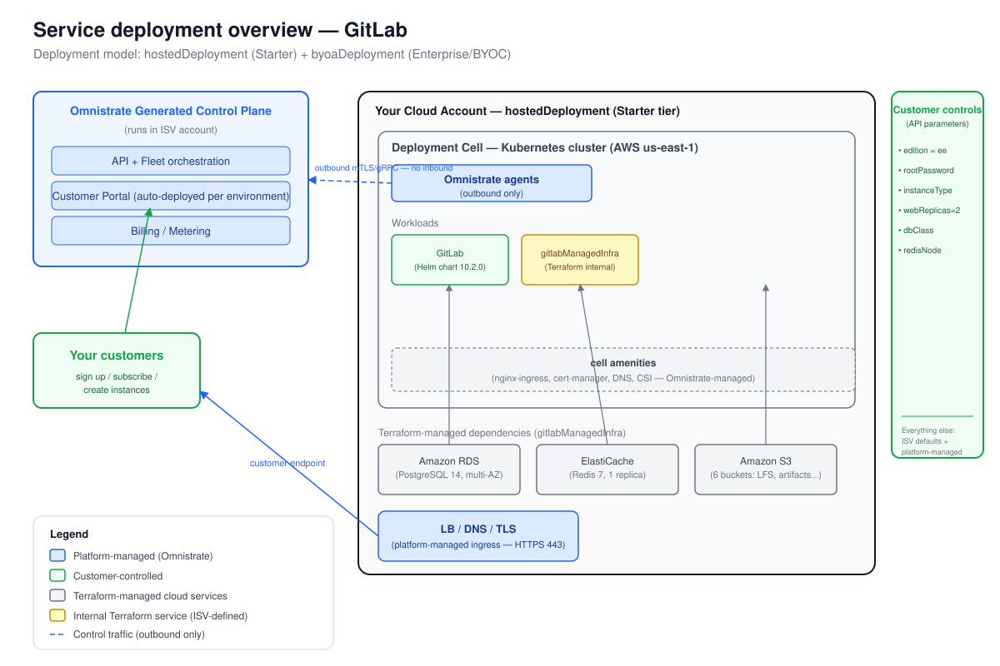

# Deployment Overview — GitLab

_Generated at the end of Omnistrate onboarding. Deployment model(s): hostedDeployment (Starter tier) + byoaDeployment (Enterprise/BYOC tier)._

## 1. Architecture



_The diagram is `deployment-overview.svg`, derived from the Omnistrate architecture
base template. The Omnistrate control plane (in Omnistrate's account) provisions and
operates a deployment cell — a Kubernetes cluster plus network, cell amenities, and
outbound-only agents — in the boundary shown; customers reach the workloads through
the platform-managed endpoint._

**Multi-model note:** Two separate SVG diagrams are produced — `deployment-overview-hosted.svg`
(boundary = "Your Cloud Account — hostedDeployment") and `deployment-overview-byoc.svg`
(boundary = "Customer's Cloud Account — byoaDeployment"). The `deployment-overview.svg`
here depicts the Hosted (Starter) model. The recipe does not define a multi-model SVG
convention beyond producing one per model; this simulation records that gap in
`gitlab-gaps.md`.

_Internal terraform service (`gitlabManagedInfra`) provisions RDS PostgreSQL, ElastiCache Redis,
and six S3 buckets before the GitLab Helm chart deploys. The Helm chart's bundled PostgreSQL
and Redis subcharts are bypassed by setting `global.psql.host` and `global.redis.host`._

## 2. Responsibility split

| Customer controls | ISV controls | Platform manages |
|-------------------|--------------|------------------|
| gitlabEdition = ee | GitLab chart version 10.2.0 | Placement / node scheduling |
| rootPassword (Password) | webservice/sidekiq image tags | Networking, DNS, TLS |
| instanceType = m6i.2xlarge | smtp / omniauth defaults | Storage provisioning |
| webserviceReplicas = 2 | Cell amenity: nginx-ingress, cert-manager | RDS backups (automated snapshots) |
| dbInstanceClass = db.t3.large | Tier-2 tuning defaults | ElastiCache failover |
| redisNodeType = cache.t3.medium | Upgrade cadence | S3 durability / versioning |
| Cloud account (BYOC enterprise tier) | Terraform infra definitions | Licensing (BYOC enterprise tier) |

## 3. Distribution summary

- **Portal URL:** `https://portal.yourgitlabsaas.example.com` _(placeholder — configure in Tenant Management)_
- **Subscription mode:** auto-approve (Starter/hosted); manual review (Enterprise/BYOC)
- **Chart version:** `10.2.0` (GitLab appVersion `v19.2.0`)
- **Managed dependencies:** Amazon RDS PostgreSQL 14, Amazon ElastiCache Redis 7, Amazon S3 (6 buckets)

**Steps your customers follow:**

- **Hosted (Starter):** Sign up in the portal, subscribe to the Starter plan, and create a GitLab instance choosing edition, instance type, webservice replicas, and root password. GitLab runs in the ISV's AWS account.

- **BYOC (Enterprise):** Sign up in the portal, connect their AWS cloud account via the portal walkthrough (CloudFormation bootstrap), then create a GitLab instance in their account. The `gitlabManagedInfra` terraform service provisions RDS, ElastiCache, and S3 buckets in the customer's account before GitLab deploys. Cost for managed services lands in the customer's AWS bill.

## 4. Build and deploy commands

```bash
# Build from examples/helm/gitlab/ directory (uses local terraform artifactRelativePath)
cd /path/to/examples/helm/gitlab
omnistrate-ctl login --email "$EMAIL" --password-stdin

omnistrate-ctl build \
  --spec-type ServicePlanSpec \
  --file spec.yaml \
  --product-name "GitLab" \
  --environment Dev \
  --environment-type Dev \
  --release-as-preferred

# Create a Hosted instance (Starter tier)
omnistrate-ctl instance create \
  --service "GitLab" \
  --plan "GitLab" \
  --environment Dev \
  --cloud-provider aws \
  --region us-east-1 \
  --resource "GitLab" \
  --param '{"gitlabEdition":"ee","rootPassword":"<strong-password>","instanceType":"m6i.2xlarge","webserviceReplicas":"2","dbInstanceClass":"db.t3.large","redisNodeType":"cache.t3.medium"}' \
  --output json

# Debug (GitLab takes 10-15 min to fully initialize)
omnistrate-ctl instance describe <instance-id> --output json
omnistrate-ctl instance debug <instance-id>
```

## 5. Known configuration prerequisites

Before the instance can reach RUNNING, the following Kubernetes secrets must be present
(create via Omnistrate Secrets or pre-create in the namespace):

| Secret name | Key | Content |
|-------------|-----|---------|
| `gitlab-postgresql-password` | `postgresql-password` | RDS PostgreSQL password |
| `gitlab-initial-root-password` | `password` | GitLab root user password |
| `gitlab-object-storage` | `connection` | S3 connection YAML (fog-aws format) |

**TODO-GAP:** Omnistrate Helm spec does not provide a built-in secret-injection mechanism
for chart-consumed Kubernetes secrets that must exist before Helm install. The ISV must
pre-create these via a terraform null_resource or an actionHook. The guide does not cover
this pattern for Helm charts.
