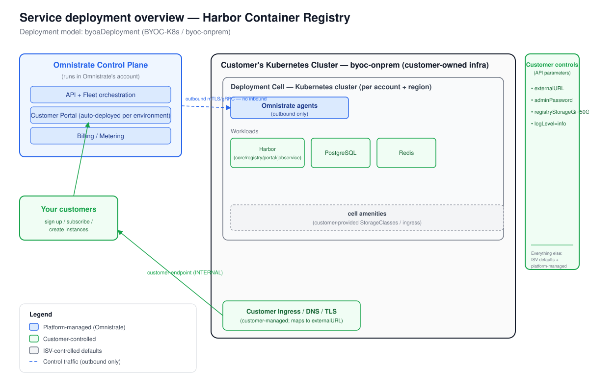

# Deployment Overview — Harbor Container Registry

_Generated at the end of Omnistrate onboarding. Deployment model(s): BYOC-K8s (byoaDeployment, byoc-onprem)._

## 1. Architecture



_The diagram is `deployment-overview.svg`, derived from the Omnistrate architecture base template.
The Omnistrate control plane (in Omnistrate's account) operates deployments in the customer's
existing Kubernetes cluster via a dataplane agent. The agent opens an **outbound-only** mTLS/gRPC
channel to the control plane — Omnistrate provisions no infra and manages no cloud accounts.
The customer owns the cluster, storage (PVCs), ingress/DNS/TLS, and endpoint exposure._

## 2. Responsibility split

| Customer controls | ISV controls | Platform manages |
|-------------------|--------------|------------------|
| `externalURL` (required — their ingress hostname) | Harbor chart version pinned at 1.19.1 | Placement / node scheduling (affinity injection) |
| `adminPassword` (Password, not exported) | `expose.type: clusterIP` (service type) | Dataplane agent lifecycle in customer cluster |
| `registryStorageGi = 50Gi` (registry PVC size) | `secretKey` (16-char encryption key) | Chart install / upgrade / delete lifecycle |
| `logLevel = info` | Internal DB/Redis chart defaults | Helm release management |
| Cluster / nodes / storage (cluster owns) | Tier-2 defaults (internalTLS, metrics, trivy) | Licensing (BYOC) |
| Ingress controller + DNS + TLS (cluster owns) | Image versions (goharbor/* images) | |

## 3. Distribution summary

- **Portal URL:** _(configure via Tenant Management > Customer Portal with CNAME to your domain)_
- **Subscription mode:** manual review recommended (BYOC-K8s requires customer cluster setup first)
- **Steps your customers follow (BYOC-K8s):**
  1. Sign up in your Customer Portal and subscribe to the Harbor plan.
  2. Run the install kit to connect their existing Kubernetes cluster to your control plane:
     ```bash
     mkdir -p dp-install-kit && cd dp-install-kit
     omnistrate-ctl account customer create \
       --service=<service-name> --environment=<environment-name> \
       --plan=<plan-name> --cluster-name=<their-cluster-name> \
       --cluster-description="Production Kubernetes cluster"
     tar xf byoc-onprem-install-kit-<account-config-id>.tar
     ./install.sh --non-interactive
     ```
  3. Wait for the onboarding instance to become `READY` (the agent connects outbound).
  4. Ensure their cluster has a default StorageClass and an ingress controller installed.
  5. Create a Harbor instance from the portal (or via CLI), providing:
     - `externalURL`: the FQDN their ingress will serve (e.g. `https://harbor.their-domain.com`)
     - `adminPassword`: initial admin credential
     - `registryStorageGi`: PVC size for image storage (default `50Gi`)
     - `logLevel`: optional (default `info`)
  6. Deploy instance:
     ```bash
     omnistrate-ctl instance create \
       --service=<service-name> --environment=<environment-name> \
       --plan=<plan-name> --version=latest \
       --resource="Harbor Registry" \
       --cloud-provider=byoc-onprem --region=on-prem \
       --customer-account-id=<customer-account-instance-id> \
       --param '{"externalURL":"https://harbor.their-domain.com","adminPassword":"<pass>","registryStorageGi":"50Gi","logLevel":"info"}' \
       --wait
     ```
  7. Configure their ingress controller to route to the `harbor` ClusterIP service (port 80/443)
     and point their DNS to the ingress endpoint matching `externalURL`.
  8. Access Harbor at `externalURL` and log in with username `admin` and the password provided.

## 4. Cluster prerequisites (customer must satisfy before step 2)

| Requirement | Details |
|-------------|---------|
| Kubernetes version | Supported version (see Harbor v2.15.1 release notes) |
| Default StorageClass | Required for all Harbor PVCs (registry, DB, Redis, jobservice, trivy) |
| Ingress controller | nginx or equivalent; must route to `harbor` ClusterIP on 80/443 |
| DNS + TLS | `externalURL` hostname must resolve to the ingress endpoint; TLS cert (cert-manager or manual) |
| Outbound egress | Cluster must reach `helm.goharbor.io` and `docker.io` for chart/image pulls |
| Pod networking | Standard CNI; Harbor components communicate over ClusterIP |

## 5. External dependency note (Option A rationale)

Harbor bundles PostgreSQL, Redis, and PVC-backed image storage. For BYOC-K8s (customer-managed
cluster, no Omnistrate-managed cloud account), the in-cluster bundled defaults (Option A) are
used. The terraform-managed cloud service pattern (Option B: RDS / ElastiCache / S3) does not
apply here because BYOC-K8s has no cloud-account terraform target. See `CUSTOMIZATION.md` for
full analysis and the S3 storage backend option for egress-capable customers.
