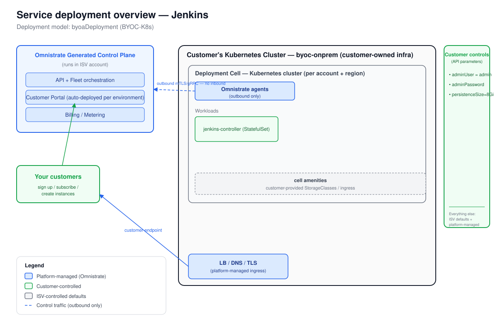

# Deployment Overview — Jenkins

_Generated at the end of Omnistrate onboarding. Deployment model: BYOC-K8s (`byoaDeployment`, deployed with `--cloud-provider byoc-onprem --region on-prem`)._

## 1. Architecture



_The diagram is `deployment-overview.svg`, derived from the Omnistrate architecture base template. The Omnistrate generated control plane (in your ISV account) provisions and operates the Jenkins workload into the customer's existing Kubernetes cluster via the dataplane agent. Omnistrate does not provision nodes or cluster infra — the customer owns the cluster. The Jenkins UI is reachable on the internal cluster endpoint shown; customers reach it through their cluster's own DNS and routing._

## 2. Responsibility split

| Customer controls | ISV controls | Platform manages |
|-------------------|--------------|------------------|
| `adminUser` = `admin` | Jenkins chart version 5.9.42 | Dataplane agent deployment |
| `adminPassword` (Password, required) | Plugin baseline (kubernetes, workflow-aggregator, git, configuration-as-code) | Helm install / upgrade lifecycle |
| `persistenceSizeGi` = `8Gi` | Resource limits (CPU/memory) | Affinity injection (automatic) |
| Kubernetes cluster (nodes, StorageClass, DNS, routing) | Agent pool configuration | Build / release versioning |
| | JCasC defaults | Endpoint surfacing (internalClusterEndpoint) |

## 3. Distribution summary

- **Portal URL:** `<https://portal.yourcompany.com>` — configure via Tenant Management > Customer Portal (custom CNAME, SMTP, SSO)
- **Subscription mode:** manual review recommended for initial launch; switch to auto-approve post-beta
- **Steps your customers follow (BYOC-K8s):**
  1. Sign up in your Customer Portal and subscribe to the Jenkins plan.
  2. Run the install kit to connect their existing Kubernetes cluster — the kit installs the Omnistrate dataplane agent, which opens an outbound mTLS/gRPC channel to your control plane:
     ```bash
     mkdir -p dp-install-kit && cd dp-install-kit
     omnistrate-ctl account customer create \
       --service=Jenkins --environment=Prod \
       --plan=Jenkins --cluster-name=<customer-cluster-name>
     tar xf byoc-onprem-install-kit-<account-config-id>.tar
     ./install.sh --non-interactive
     ```
  3. Once the account status is `READY`, create a Jenkins instance from the portal, supplying:
     - Admin username (default: `admin`)
     - Admin password (required)
     - Persistence size (default: `8Gi`)
  4. Reach the Jenkins UI at the internal cluster endpoint surfaced on the instance details page. Configure ingress / port-forwarding at the cluster level as needed.

- **Customer cluster prerequisites:**
  - A working StorageClass (default or named) for the Jenkins PVC
  - Pod networking, DNS, and outbound egress to your control plane
  - Kubernetes cluster with supported version

- **Note on JCasC:** Advanced JCasC configuration is not exposed as a customer parameter at create time. Customers requiring JCasC-driven pipeline or security configuration should apply it post-deploy via the Jenkins UI or via a ConfigMap mounted as `controller.JCasC.configMapAnnotations` — see chart documentation.
