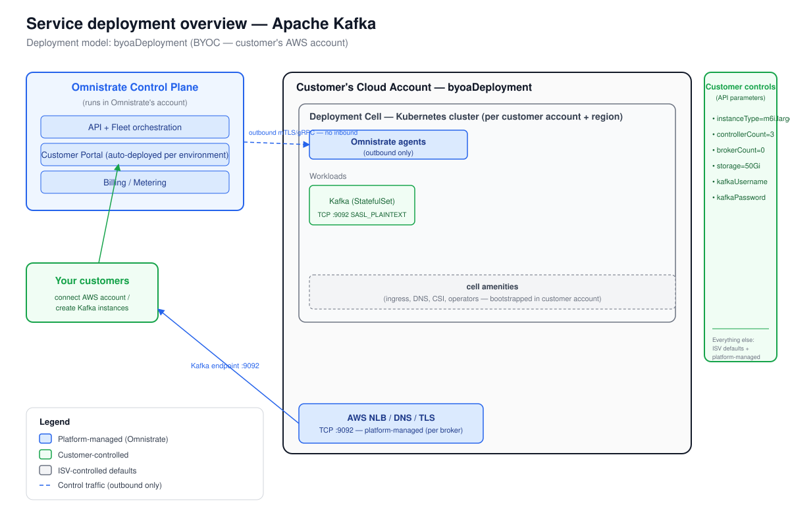

# Deployment Overview — Apache Kafka

_Generated at the end of Omnistrate onboarding. Deployment model(s): BYOC (byoaDeployment — customer's AWS account)._

## 1. Architecture

_The diagram is `deployment-overview.svg`, derived from the Omnistrate architecture base template.
The Omnistrate generated control plane (in your ISV account) provisions and operates a deployment cell —
a Kubernetes cluster plus network, cell amenities, and outbound-only agents — inside the
**customer's** AWS cloud account; customers reach Kafka through the platform-managed TCP endpoint
on port 9092 (SASL_PLAINTEXT)._

## 2. Responsibility split

| Customer controls | ISV controls | Platform manages |
|-------------------|--------------|------------------|
| `controllerReplicaCount` = 3 | Chart version 32.4.3 (Kafka 4.0.0) | Placement / node scheduling (affinity auto-injected) |
| `brokerReplicaCount` = 0 (combined mode) | KRaft mode (no Zookeeper) | Networking, DNS, TLS |
| `storageSizeGi` = 50Gi | SASL mechanism list (PLAIN + SCRAM) | Storage provisioning (PVC per node) |
| `kafkaUsername` / `kafkaPassword` | JVM heap settings | Deployment cell bootstrapping |
| `interBrokerPassword` / `controllerPassword` | External listener wiring | Load balancer (one LB per broker) |
| `instanceType` = m6i.large | Tier-2 defaults (rack awareness, TLS auto-gen) | Licensing (BYOC model) |
| Cloud account (connected via portal) | Image registry (docker.io/bitnami/kafka) | Customer Portal (per environment) |

## 3. BYOC distribution summary

- **Deployment model**: `byoaDeployment` — every instance runs inside the customer's own AWS account.
- **Subscription mode**: configure in Omnistrate (Tenant Management > Customer Portal) — auto-approve recommended for open beta; manual review for enterprise.
- **Steps your customers follow:**
  1. Sign up in your Customer Portal (custom domain, configured via CNAME).
  2. Connect their AWS account — the portal walks them through the CloudFormation bootstrap stack.
  3. The first instance in an account+region bootstraps a dedicated deployment cell (Kubernetes cluster) in their account.
  4. Create a Kafka instance, supplying: instance type, controller/broker counts, storage size, SASL credentials.
  5. The platform provisions the cluster, installs Kafka via Helm (chart 32.4.3), wires the TCP load balancer, and returns the endpoint on port 9092.
  6. Connect their Kafka clients with the provided endpoint and SASL/PLAIN credentials.

- **Customer connectivity**: TCP port 9092, SASL_PLAINTEXT, via an AWS NLB provisioned per instance in their account. The endpoint is surfaced as `externalClusterEndpoint` in the Omnistrate portal and describe API.

- **Go-live checklist** (from DISTRIBUTION_REFERENCE.md):
  1. Build and release as preferred: `omnistrate-ctl build -f spec.yaml --spec-type ServicePlanSpec --product-name "Apache Kafka" --release-as-preferred --release-description "GA release"`.
  2. Make the prod environment Public (Dev-Ops > Environments).
  3. Configure the portal: custom domain (CNAME), SMTP sender email, SSO identity provider.
  4. (Optional) Configure billing (FinOps Center > Tenant Billing + `pricing` + `billingProviders` in spec).
  5. Distribute the portal URL to customers.
