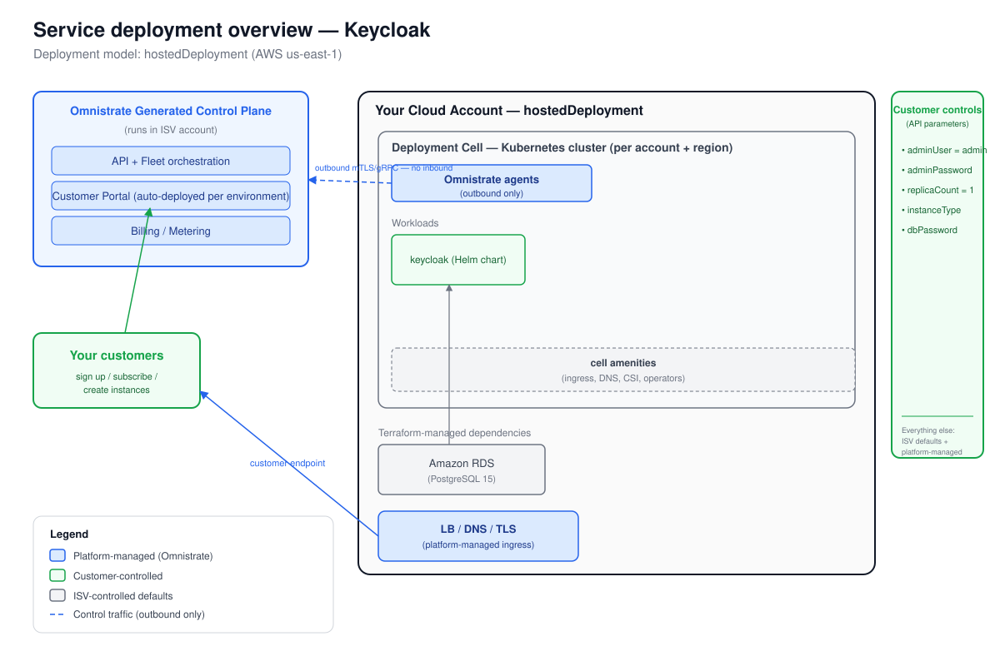

# Deployment Overview — Keycloak

_Generated at the end of Omnistrate onboarding. Deployment model(s): hostedDeployment (AWS us-east-1)._

## 1. Architecture



_The diagram is `deployment-overview.svg`, derived from the Omnistrate architecture base template
(`skills/omnistrate-fde/assets/omnistrate-architecture-base.svg`).
The Omnistrate control plane (in Omnistrate's account) provisions and operates a deployment cell —
a Kubernetes cluster plus network, cell amenities, and outbound-only agents — in your (provider)
AWS account. Keycloak runs as a Helm-managed workload inside the cell. An Amazon RDS PostgreSQL
instance is provisioned by a sibling terraform service (`keycloakDb`) inside the same account and
VPC and connected to the Keycloak pods via `externalDatabase`. Customers reach Keycloak through
the platform-managed LB / DNS / TLS endpoint._

## 2. Responsibility split

| Customer controls | ISV controls | Platform manages |
|-------------------|--------------|------------------|
| adminUser = admin | Chart version (bitnami/keycloak 25.2.0) | Placement / node scheduling |
| adminPassword (Password) | postgresql.enabled: false (subchart disabled for prod) | Networking, DNS, TLS |
| replicaCount = 1 | externalDatabase.user, database name | Storage provisioning |
| instanceType = t3.medium | Tier-2 defaults (cache.stack, extraEnvVars) | RDS subnet group, security group |
| dbPassword (Password) | Upgrade cadence | Auto-scaling, health checks |
| — | service.type + annotations (LB wiring) | Backups (RDS 7-day auto snapshots) |

**Chart: bitnami/keycloak v25.2.0 | App: Keycloak 26.3.3 | DB: Amazon RDS PostgreSQL 15 (db.t3.medium)**

## 3. Distribution summary

- **Portal URL:** https://portal.your-company.com (configure via CNAME in Customer Portal settings)
- **Subscription mode:** auto-approve (configure in Tenant Management > Subscriptions)
- **Build command:**

  ```bash
  omnistrate-ctl build \
    --spec-type ServicePlanSpec \
    --file spec.yaml \
    --product-name "Keycloak" \
    --environment Dev \
    --environment-type Dev \
    --release-as-preferred \
    --release-description "Initial release — bitnami/keycloak 25.2.0, RDS PostgreSQL 15"
  ```

- **Steps your customers follow (Hosted):**
  1. Sign up at the portal URL.
  2. Subscribe to the Keycloak plan.
  3. Create an instance — supply `adminUser`, `adminPassword`, `replicaCount`, `instanceType`, and `dbPassword`.
  4. Wait for the instance to reach **RUNNING** (Keycloak initialisation + RDS provisioning typically takes 5–15 minutes).
  5. Retrieve the `keycloakConsole` endpoint from the instance details and open it in a browser.

## 4. Go-live checklist (ordered)

1. Release Preferred — `omnistrate-ctl build ... --release-as-preferred --release-description "..."`.
2. Make the prod environment Public — Dev-Ops > Environments.
3. Configure the portal — custom domain (CNAME), SMTP sender email, SSO IdP(s).
4. (Optional) Enable billing — FinOps Center > Tenant Billing, then add `pricing` + `billingProviders` to spec.
5. Set subscription approval mode — auto-approve or manual review.
6. Distribute the portal URL to customers.
7. Monitor subscriptions — review requests, statuses, and instances.
