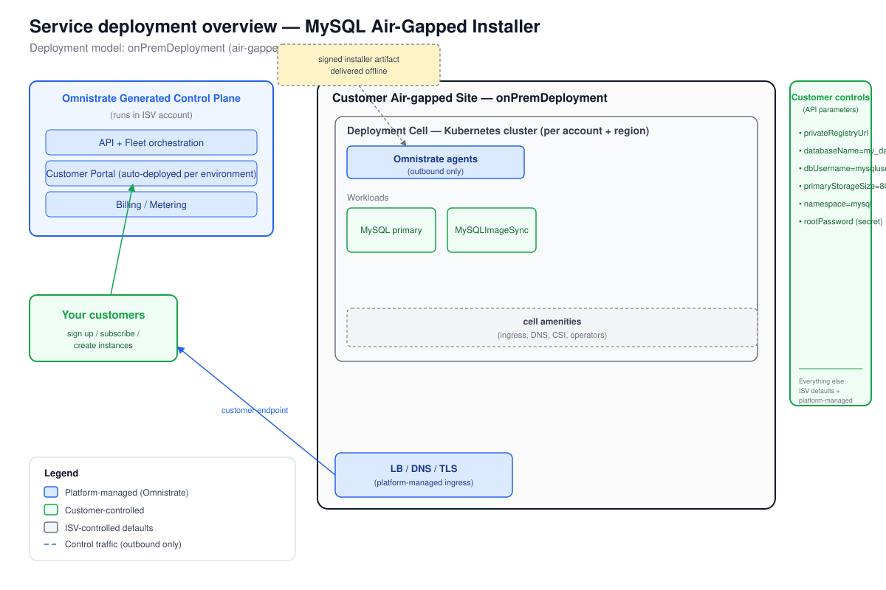

# Deployment Overview — MySQL Air-Gapped Installer

_Generated at the end of Omnistrate onboarding. Deployment model(s): air-gapped (`onPremDeployment`)._

## 1. Architecture



_The diagram is `deployment-overview.svg`, derived from the Omnistrate architecture base template.
In air-gapped mode the Omnistrate generated control plane (in your ISV account) is **not** connected to
the data plane at runtime. Instead, Omnistrate builds a self-contained installer artifact at build time
(images embedded via `INSTALLER_EMBED`, Helm chart bundled, lifecycle action-hook scripts included).
The artifact is transferred to the customer's site via offline means (USB, airlift, SFTP over private
WAN, etc.) and run by the customer against their air-gapped Kubernetes cluster. The customer owns
connectivity, updates, support, and operational-evidence boundaries — there is no live control-plane
link after delivery._

## 2. Responsibility Split

| Customer controls | ISV controls | Platform manages |
|-------------------|--------------|------------------|
| `releaseName` = `mysql` | Chart version 14.0.3 pinned | Placement / node scheduling (affinity auto-injected) |
| `namespace` = `mysql` | Architecture hardcoded to `standalone` for initial delivery | Helm install / upgrade lifecycle |
| `privateRegistryUrl` (required) | CPU / memory resource requests | Image embedding at build time (`INSTALLER_EMBED`) |
| `databaseName` = `my_database` | Tier-2 defaults (TLS off, metrics off) | Action-hook execution (VALIDATE → PRE_INSTALL → POST_INSTALL → BACKUP) |
| `dbUsername` = `mysqluser` | Upgrade cadence (offline artifact transfer) | Licensing enforcement (offline SDK; offline license baked in) |
| `primaryStorageSize` = `8Gi` | License expiry management (365-day offline license) | — |
| Root password (Password, required) | — | — |
| DB user password (Password, required) | — | — |
| Kubernetes cluster (customer-owned and -operated) | — | — |

**Licensing note:** the Omnistrate offline license is signed with a CA baked into the SDK and expires
after 365 days. Disconnected deployments **do not** auto-renew — the customer must receive a new
installer artifact (or license bundle) before expiration. Enforcement is fully offline: even without
internet the running deployment stops at license expiry if the SDK is integrated.

## 3. Distribution Summary

- **Distribution method:** self-contained installer artifact delivered via offline transfer (USB,
  secure file drop, airlift). No portal or live subscription flow applies.
- **Build command:**
  ```bash
  omnistrate-ctl build \
    --spec-type ServicePlanSpec \
    --file spec.yaml \
    --product-name "MySQL Air-Gapped Installer" \
    --release \
    --release-description "v14.0.3 initial air-gapped release"
  ```
- **Subscription mode:** N/A — air-gapped deliveries are governed by contract, not portal
  self-service. License validity is the enforcement mechanism.
- **Steps your customers follow:**
  1. Receive the installer artifact package from the ISV via offline transfer.
  2. Confirm their Kubernetes cluster satisfies requirements: version >= 1.30, a working StorageClass,
     and an internal image registry reachable from cluster nodes.
  3. Run the installer — it executes VALIDATE, PRE\_INSTALL (namespace + imagePullSecret creation),
     Helm install, POST\_INSTALL (readiness wait + health check), in sequence.
  4. Connect their applications to MySQL at the internal cluster endpoint on port 3306.
  5. Before upgrades, the BACKUP hook dumps all databases to `/tmp/mysql-backup-<timestamp>.tar.gz`
     — transfer this off-cluster before proceeding.
  6. Renew the license by receiving an updated artifact before the 365-day offline license expires.
