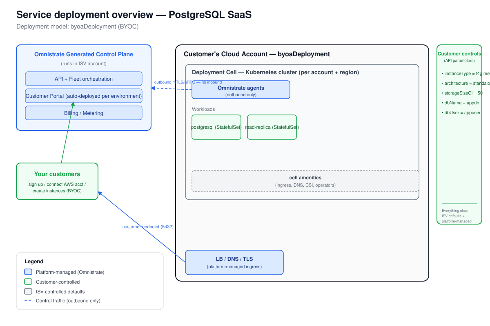

# Deployment Overview — PostgreSQL SaaS

_Generated at the end of Omnistrate onboarding. Deployment model(s): BYOC (byoaDeployment), AWS us-east-1._
_Chart: bitnami/postgresql v18.8.0 (PostgreSQL 18.4.0)._

---

## 1. Architecture



_The diagram is `deployment-overview.svg`, derived from the Omnistrate architecture
base template (`skills/omnistrate-fde/assets/omnistrate-architecture-base.svg`)
with BYOC-specific edits applied per DISTRIBUTION_REFERENCE.md.
The Omnistrate generated control plane (in your ISV account) provisions and operates a
deployment cell — a Kubernetes cluster plus network, cell amenities, and
outbound-only agents — inside **the customer's own AWS account**. Customers reach
the PostgreSQL workloads through the platform-managed LB / DNS / TLS endpoint on
port 5432. The deployment cell boundary is labeled "Customer's Cloud Account —
byoaDeployment" per the DISTRIBUTION_REFERENCE.md boundary-label table._

The data plane shows two StatefulSet workloads (primary PostgreSQL + read replica).
In `architecture=standalone` mode, the read replica StatefulSet is absent; the
chart deploys only the primary. In `architecture=replication` mode, both are
deployed with streaming replication.

---

## 2. Responsibility split

| Customer controls | ISV controls | Platform manages |
|-------------------|--------------|------------------|
| `instanceType` = t4g.medium | Bitnami chart version (18.8.0) | Placement / node scheduling (affinity injection) |
| `architecture` = standalone | PostgreSQL version (app 18.4.0) | Networking, DNS, TLS |
| `storageSizeGi` = 50 (GiB) | Tier-2 defaults (audit, tuning, shared_preload_libraries) | Storage provisioning (PVC per StatefulSet) |
| `dbName` = appdb | Service type / annotations (LB + external-dns wired) | Backups (PVC-based by default; S3 is a future addition — see CUSTOMIZATION.md) |
| `dbUser` = appuser | Affinity rules (chartAffinityControl.enableInjection=true) | Licensing (BYOC — ISV configures if needed) |
| `postgresPassword` (Password) | Security posture (FIPS default, allowInsecureImages=false) | Deployment cell bootstrap (first instance per account+region) |
| `dbPassword` (Password) | | |
| `readReplicaCount` = 1 (when replication) | | |
| AWS account (BYOC — connected via portal) | | |

---

## 3. Distribution summary

- **Portal URL:** `https://portal.yourcompany.com` — placeholder; configure via
  Tenant Management > Customer Portal > Custom Domain (CNAME).
- **Subscription mode:** recommend manual review during beta; switch to auto-approve post-GA.
- **Release:** `omnistrate-ctl build -f spec.yaml --spec-type ServicePlanSpec --product-name "PostgreSQL SaaS" --environment Prod --release-as-preferred --release-description "GA v18.8.0"`
- **Prod environment:** make Public in Dev-Ops > Environments after portal and SMTP are configured.

### Steps your customers follow (BYOC)

1. Customer visits your Customer Portal URL and signs up.
2. Customer subscribes to the PostgreSQL plan.
3. Customer clicks **"Connect Cloud Account"** in the portal:
   - The portal walks them through an AWS CloudFormation stack that installs the
     Omnistrate bootstrap role in their account.
   - Status is tracked live; the account moves to `READY` once CloudFormation completes.
   - **ISV-assisted alternative (CLI):**
     ```bash
     omnistrate-ctl account customer create \
       --service="PostgreSQL SaaS" --environment=Prod \
       --plan="PostgreSQL" \
       --customer-email=<customer@example.com> \
       --aws-account-id=<CUSTOMER_AWS_ACCOUNT_ID>
     # Note the customer-account-instance-id returned; find backing accountConfigID:
     omnistrate-ctl account customer describe <customer-account-instance-id> -o json
     # Then guide customer to complete CloudFormation, or assist:
     omnistrate-ctl account describe <account-config-id>   # Actions -> Bootstrap
     ```
4. Customer creates a PostgreSQL instance in the portal, supplying the Tier-1 parameters:
   - **Instance Type** (default: t4g.medium)
   - **Architecture** (default: standalone)
   - **Storage Size** (default: 50 GiB)
   - **Database Name** (default: appdb)
   - **Database Username** (default: appuser)
   - **Postgres Admin Password** (required, never exported)
   - **Database User Password** (required, never exported)
   - **Read Replica Count** (default: 1; relevant only for replication architecture)
5. Omnistrate bootstraps the deployment cell in the customer's account+region on
   their first instance (subsequent instances in the same account+region reuse the cell).
6. Instance reaches RUNNING; customer retrieves the writer endpoint (port 5432)
   from the portal or via `omnistrate-ctl instance describe <id>`.
7. Customer connects their application to the writer endpoint. In replication mode,
   a reader endpoint (prefixed hostname) is also available.

### Go-live checklist (per DISTRIBUTION_REFERENCE.md §Go-live)

- [ ] `--release-as-preferred` with `--release-description`
- [ ] Prod environment set to **Public** (Dev-Ops > Environments)
- [ ] Custom domain CNAME configured (Tenant Management > Customer Portal)
- [ ] SMTP sender email configured
- [ ] At least one SSO identity provider (or username/password)
- [ ] Subscription approval mode set
- [ ] Portal URL distributed to customers

---

## 4. Build and deploy (SIMULATED — no omnistrate-ctl account available)

```bash
# Phase 0: verify provisioner account is READY
omnistrate-ctl account list
omnistrate-ctl account describe <provisioner-account-name>

# Phase 1–2: minimal build (zero parameterization first per SKILL.md phase 2)
# [Simulate] Build would be run after hardcoding all values in a scratch spec
# then parameterizing one value per build-deploy cycle.

# Phase 3: build with Tier-1 parameters wired
omnistrate-ctl build \
  --spec-type ServicePlanSpec \
  --file spec.yaml \
  --product-name "PostgreSQL SaaS" \
  --environment Dev \
  --environment-type Dev \
  --release-as-preferred

# Phase 4: deploy one instance to Dev (BYOC Dev customer account)
omnistrate-ctl instance create \
  --service="PostgreSQL SaaS" \
  --plan="PostgreSQL" \
  --environment Dev \
  --cloud-provider aws \
  --region us-east-1 \
  --resource="PostgreSQL Cluster" \
  --customer-account-id=<customer-account-instance-id> \
  --param '{"architecture":"standalone","postgresPassword":"<secret>","dbName":"appdb","dbUser":"appuser","dbPassword":"<secret>","instanceType":"t4g.medium","storageSizeGi":"50","readReplicaCount":"1"}' \
  --output json

# Debug loop (SKILL.md phase 4):
omnistrate-ctl instance describe <instance-id> --deployment-status --output json
omnistrate-ctl instance debug <instance-id>
```
