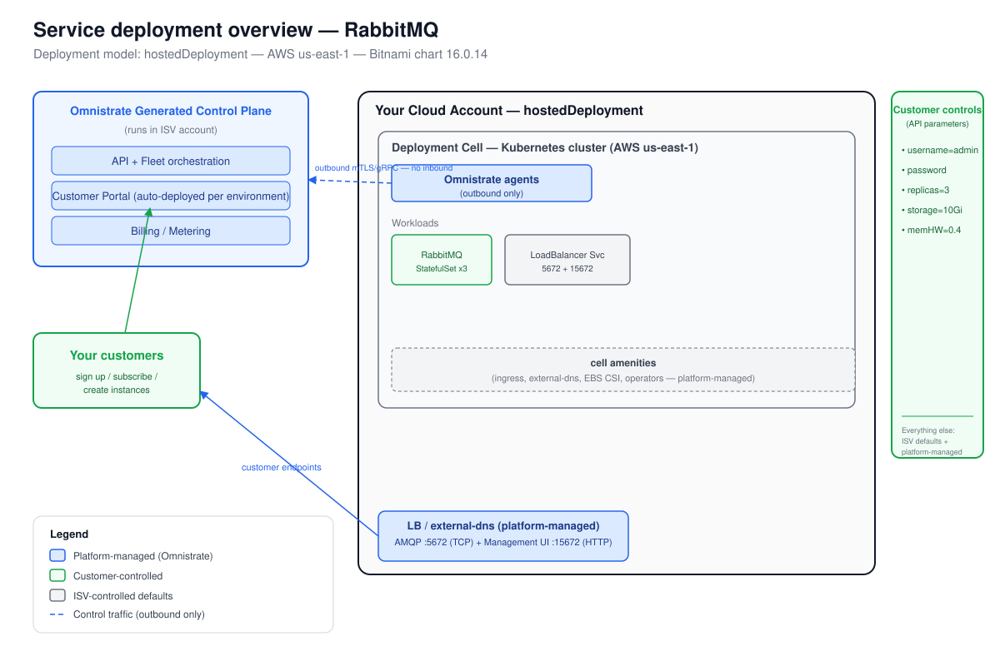

# Deployment Overview — RabbitMQ (Bitnami Helm, Hosted)

_Generated at the end of Omnistrate onboarding simulation. Deployment model(s): hostedDeployment (AWS us-east-1)._

## 1. Architecture

_The diagram is `deployment-overview.svg`, derived from the Omnistrate architecture
base template (`skills/omnistrate-fde/assets/omnistrate-architecture-base.svg`).
The Omnistrate generated control plane (in your ISV account) provisions and operates a
deployment cell — a Kubernetes cluster plus network, cell amenities, and
outbound-only mTLS/gRPC agents — in your (provider) AWS account in us-east-1.
Customers reach RabbitMQ through the platform-managed LoadBalancer endpoint with
external-dns–assigned hostname.
Two named endpoints are surfaced: AMQP (TCP/5672) for application connections and
Management UI (HTTP/15672) for operations._

## 2. Responsibility split

| Customer controls | ISV controls | Platform manages |
|-------------------|--------------|------------------|
| Admin Username = `admin` | Chart version (16.0.14 pinned) | Placement / node scheduling |
| Admin Password (Password, unexported) | Erlang cookie (hardcoded Phase 1) | Networking, DNS, TLS |
| Replica Count = 3 (1–7, odd recommended) | Partition handling = `autoheal` | Storage provisioning (EBS gp3) |
| Storage Size = 10 GiB per node | Plugins (`rabbitmq_management`, `rabbitmq_peer_discovery_k8s`) | Cell amenities: ingress, external-dns, CSI |
| Memory High Watermark = 0.4 (40%) | Instance type = `t3.large` (ISV default) | Load balancer (one LB for AMQP + Management) |

## 3. Distribution summary

- **Deployment model:** Hosted — instances run in your (ISV) AWS account via `hostedDeployment`.
- **Region:** AWS us-east-1.
- **Portal URL:** `<https://portal.yourcompany.com — configure CNAME in Omnistrate Customer Portal settings>`
- **Subscription mode:** manual review recommended for initial launch; switch to auto-approve post-GA.
- **Steps your customers follow (Hosted):**
  1. Sign up and subscribe in your Customer Portal.
  2. Create an instance, supplying: Admin Username, Admin Password, Replica Count, Storage Size, Memory High Watermark.
  3. Receive the AMQP endpoint (`host:5672`) and Management UI endpoint (`host:15672`) once RUNNING.
  4. Connect AMQP clients with `amqp://<username>:<password>@<endpoint>:5672/`.
  5. Access the Management UI at `http://<endpoint>:15672` with the same credentials.

## 4. Endpoint notes (mixed TCP + HTTP)

RabbitMQ requires two externally reachable endpoints:
- **AMQP 5672** — TCP protocol; clients use this for message publishing and consuming.
- **Management UI 15672** — HTTP; used by operators and monitoring tools.

Both ports are exposed on the **same Kubernetes LoadBalancer Service** (`service.type: LoadBalancer`).
Omnistrate's external-dns amenity assigns a per-instance hostname via the `external-dns.alpha.kubernetes.io/hostname` annotation.
The `endpointConfiguration` block in `spec.yaml` surfaces them as two named endpoints (`amqp` and `managementUI`) to customers in the portal and API.

**Important limitation (see `rabbitmq-gaps.md`):** The `HELM_ONBOARDING_REFERENCE.md` documents `loadBalancers.https` for HTTP-terminated load balancers but provides no guidance for `loadBalancers.tcp` (or equivalent) in the Helm/ServicePlanSpec path. The approach above (chart-managed LoadBalancer + external-dns annotation) works but bypasses the plan-level LB block. ISVs requiring TLS termination at the LB for the Management UI must research the `loadBalancers.https` path with `targetKubernetesServiceName` separately.
