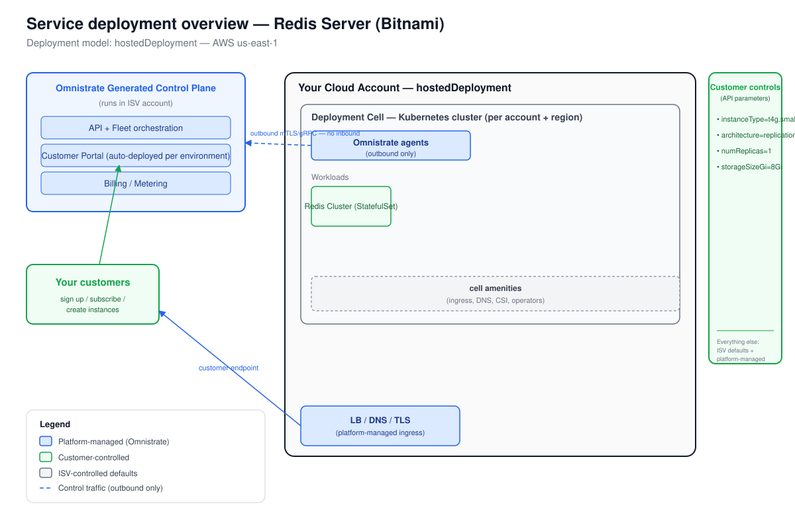

# Deployment Overview — Redis Server (Bitnami)

_Generated at the end of Omnistrate onboarding. Deployment model(s): hostedDeployment (AWS us-east-1)._

Chart: `bitnami/redis` version `27.0.15` (appVersion `8.8.0`)

---

## 1. Architecture

_The diagram is `deployment-overview.svg`, derived from the Omnistrate architecture
base template. The Omnistrate generated control plane (in your ISV account) provisions and
operates a deployment cell — a Kubernetes cluster plus network, cell amenities, and
outbound-only agents — in the boundary shown (your AWS account); customers reach the
Redis workloads through the platform-managed endpoint (LoadBalancer + External-DNS)._

**Workload:** `Redis Cluster` — a Bitnami Redis StatefulSet (master + replica nodes),
deployed by Omnistrate via `helm install bitnami/redis`. Affinity is automatically
injected by Omnistrate to pin pods to managed node groups. No external managed-cloud
dependency (Redis is the data service itself).

---

## 2. Responsibility split

| Customer controls | ISV controls | Platform manages |
|---|---|---|
| `instanceType = t4g.small` | Chart version (27.0.15 / Redis 8.8.0) | Node pool provisioning + scheduling |
| `architecture = replication` | Module config (RediSearch, ReJSON via commonConfiguration) | Networking, DNS, TLS |
| `numReplicas = 1` | Disabled commands (FLUSHDB, FLUSHALL) | PVC provisioning (CSI driver) |
| `storageSizeGi = 8Gi` | Upgrade cadence | Load balancer + External-DNS hostname |
| `auth.password` (Password param) | Tier-2 tuning defaults (resources, probes) | Auto-affinity injection into pods |
|   | metrics.enabled = false (off by default) | Backup snapshots (if lifecycle phase added) |

---

## 3. Distribution summary

- **Portal URL:** `<https://portal.yourcompany.com — placeholder; configure CNAME after go-live>`
- **Subscription mode:** auto-approve (recommended for self-serve) or manual review (for controlled beta)
- **Go-live checklist:**
  1. Run `omnistrate-ctl build -f spec.yaml --spec-type ServicePlanSpec --product-name "Redis Server" --environment Dev --environment-type Dev --release-as-preferred`
  2. Verify instance reaches RUNNING: `omnistrate-ctl instance create ... --resource "Redis Cluster" --param '{"instanceType":"t4g.small","architecture":"replication","numReplicas":"1","storageSizeGi":"8Gi"}' --output json`
  3. Promote to Production: rebuild targeting the prod environment with prod account IDs.
  4. Make the prod environment Public (Dev-Ops > Environments).
  5. Configure Customer Portal: custom domain (CNAME), SMTP sender email, SSO IdP.
  6. Distribute the portal URL to customers.

- **Steps your customers follow (Hosted):**
  - Sign up in the portal, subscribe to the Redis Server plan.
  - Choose instance type, architecture (standalone/replication), replica count, and storage size.
  - Create the instance — Omnistrate provisions the cluster, installs the chart, and returns a Redis endpoint.
  - Connect using the returned hostname + port 6379 with the password supplied at creation time.
