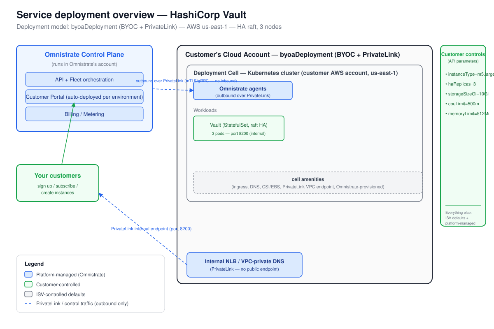

# Deployment Overview — HashiCorp Vault

_Generated at the end of simulated Omnistrate onboarding. Deployment model(s): BYOC with PrivateLink (`byoaDeployment`)._

---

## 1. Architecture

_The diagram is `deployment-overview.svg`, derived from the Omnistrate architecture base template. The Omnistrate generated control plane (in your ISV account) provisions and operates a deployment cell — a Kubernetes cluster plus network, cell amenities, and outbound-only agents — in the customer's AWS account. Vault pods communicate over raft internally. Customers reach Vault exclusively through a PrivateLink-backed internal endpoint (no public internet exposure); the Omnistrate control-plane channel to the dataplane agent is also routed over AWS PrivateLink (the `--private-link` flag on customer account onboarding). There is no public endpoint; the `LB / DNS / TLS` box in the diagram represents an internal NLB or VPC-private DNS entry only._

**PrivateLink requirements (customer VPC, per DEPLOYMENT_MODELS_REFERENCE.md §PrivateLink):**

| # | Requirement |
|---|-------------|
| 1 | Tag VPC and workload subnets: `omnistrate.com/managed-by = omnistrate` |
| 2 | Enable `enableDnsSupport` and `enableDnsHostnames` on the VPC |
| 3 | Outbound internet via NAT Gateway (for Helm chart and image pulls during bootstrap) |
| 4 | Interface VPC Endpoint to the Omnistrate PrivateLink service name provided; tag `Name = omnistrate-byoc-private-vpce-<provisioner-hc-id>`; SG inbound TCP 8443–8506 from VPC CIDR |
| 5 | Cross-region: pass `--service-region` to `aws ec2 create-vpc-endpoint`; do NOT enable private DNS for cross-region endpoints |

---

## 2. Responsibility split

| Customer controls | ISV controls | Platform manages |
|-------------------|--------------|------------------|
| instanceType = m5.large | hashicorp/vault chart 0.34.0 | Placement / node scheduling (affinity injection) |
| haReplicas = 3 | `global.tlsDisable = true` (LB handles TLS) | Networking, DNS, internal endpoint |
| storageSizeGi = 10Gi | `server.ha.raft.config` (topology) | EBS PVC provisioning (CSI) |
| cpuLimit = 500m | `injector.enabled = false` | Vault pod anti-affinity (separate hosts) |
| memoryLimit = 512Mi | Upgrade cadence | Kubernetes node pools |
| Cloud account (BYOC) | Tier-2 defaults (audit storage, telemetry) | PrivateLink VPC endpoint lifecycle |

---

## 3. Distribution summary

- **Portal URL:** `<https://portal.yourcompany.com>` — configure via Tenant Management > Customer Portal (CNAME + SMTP + SSO IdP).
- **Subscription mode:** manual review recommended for regulated BYOC customers (enables pre-screening before cloud account onboarding).
- **Steps your customers follow (BYOC + PrivateLink path):**
  1. Sign up in your Customer Portal and request a subscription.
  2. On approval: connect their AWS account via the portal (CloudFormation bootstrap). The first instance in an account+region bootstraps the deployment cell.
  3. Pre-provision the PrivateLink VPC endpoint in their account (see requirements table above, or use `--allow-create-new-cloud-native-network` to let Omnistrate provision it).
  4. Create a Vault instance from the portal, selecting instance type, replica count, storage size, and resource limits.
  5. After the instance reaches RUNNING, initialize Vault (`vault operator init`) via the internal PrivateLink endpoint. Auto-unseal via AWS KMS is strongly recommended for production (see CUSTOMIZATION.md §Auto-unseal — GAP-2).
  6. Vault is accessible only within the customer's VPC (or via peering/TGW from on-premises) — no public internet exposure by design.

- **HA note:** the 3-replica raft configuration provides quorum tolerance of 1 node failure. Changing replica count requires re-provisioning (param is `modifiable: false`).
- **Backup note:** Vault raft snapshots are not yet wired to an Omnistrate lifecycle verb — see `vault-gaps.md` GAP-3.
