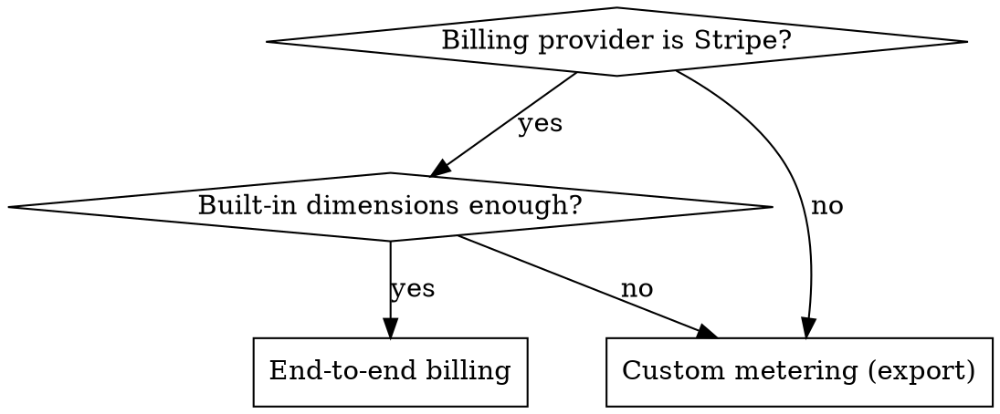

# Billing & Metering Reference (FinOps)

How to monetize a Plan: Omnistrate-managed **end-to-end billing** (Stripe), or
**usage metering export** (BYOB) feeding your own billing system, marketplace,
or custom aggregation logic.

Based on the Omnistrate FinOps guides and verified against the live JSON schema.
**When this file conflicts with the live schema, docs, or CLI `--help`, trust
those and update this file** — read them with `omctl docs` (no
`omnistrate-ctl login` needed; network access is):

- `omctl docs plan-spec "pricing"` · `omctl docs plan-spec "metering"` ·
  `omctl docs plan-spec "billing provider"` — the three billing sections
- `omctl docs json-schema service-plan` — the authoritative schema; the billing
  definitions are `$defs.DimensionPricing`, `$defs.MeteringConfiguration` and
  `$defs.BillingProvider`
- `omctl docs search "metering export" --limit 15` — the FinOps guides

Add `-o json` for machine-readable output. Billable dimensions are a closed set —
check the schema before promising a custom one.

**Billing is opt-in — no billing configured = free tier.** Never add pricing,
billing providers, or metering during the zero-parameterization phase. This is
production-hardening work (workflow phase 6), after an instance reaches RUNNING.

---

## 1. Choose the path — end-to-end billing vs custom metering

This is the first question, and the answer is driven by two things only: **which
billing provider** the ISV bills through, and **whether the five built-in
dimensions are enough**.



| Situation | Path |
|---|---|
| Bills through **Stripe**, and the built-in dimensions (cpu / memory / storage / replica / deploymentCell) cover the pricing model | **End-to-end billing** (§3) — Omnistrate meters, aggregates, invoices, and collects payment |
| Needs **additional dimensions** beyond the built-in five (per-request, per-seat, per-document, per-GB-processed…) | **Custom metering** (§4) |
| Needs **custom billing aggregation logic** (composite dimensions, derived quantities, tiering, ISV-side rating) | **Custom metering** (§4) |
| Bills through **anything other than Stripe** — AWS / GCP / Azure Marketplace, Chargebee, Clazar, an in-house billing system | **Custom metering** (§4) |

**They are not mutually exclusive.** A Plan can run end-to-end Stripe billing
*and* export metering data (for analytics, reconciliation, or a second
provider). Adding `metering` never disables `pricing`/`billingProviders`.

> **Custom metering does not mean Omnistrate meters custom things.** Omnistrate
> meters **infrastructure only** — the exported records carry cpu / memory /
> storage / replica usage and nothing else. An application-level dimension
> (per-request, per-seat, per-document, per-GB-processed) is never emitted by
> the platform: the ISV must source it from **their own application telemetry**
> and join it in their exporter. Say this out loud when scoping — "custom
> metering" routes the *billing pipeline*, it does not create the measurement.
> See §4.6 for exactly which variables an exporter has to work with.

**Do not confuse "BYO billing provider" with custom metering.** A
`billingProviders` entry whose `name` is your own provider is a **portal-display
integration only** (name, logo, balance-due link) — it does not send usage
anywhere. The actual data handoff to any non-Stripe system is always the
metering export in §4. A BYO provider entry is optional garnish on top of it.

Ask the ISV, in plain language:

1. **"How do you want to charge — and who takes the payment?"** (Stripe /
   marketplace / existing billing system / not billing yet)
2. **"What do you charge for?"** — map their answer to the built-in dimensions;
   anything that isn't cpu/memory/storage/replica/deploymentCell means custom
   metering.
3. **"Do you need to sell through a cloud marketplace?"** — AWS/GCP/Azure
   Marketplace always means custom metering (§5).

---

## 2. Prerequisite for both paths — enable tenant billing

Tenant billing is enabled **at the account level**, outside the spec, before any
Plan-level configuration takes effect:

1. Navigate to **FinOps Center > Tenant Billing** in the Omnistrate console.
   (The feature may need to be enabled for your org — request it from
   Omnistrate support if the section is not available.)
2. Click **Add Billing Provider** and choose:
   - **OmniBilling (Stripe)** — authorize via **Stripe Connect**. Requires a
     standard Stripe account with complete business information. Configure the
     **Stripe Customer Portal** settings too (logo, requested customer data
     including billing address for tax, accepted payment methods).
   - **Bring-your-own** — configure three properties: **Name** (display name,
     and the string you put in `billingProviders[].name`), **Logo**, and
     **Balance Due Link** (where customers are redirected to pay).

Only providers enabled at the account level can be referenced from a Plan.

---

## 3. End-to-end billing (Stripe)

Omnistrate meters usage, aggregates per customer, generates invoices, and
collects payment through Stripe.

### Billable dimensions (the built-in five)

| `dimension` | `unit` | `timeUnit` | Notes |
|---|---|---|---|
| `cpu` | `cores` | `hour` | |
| `memory` | `GiB` | `hour` | |
| `storage` | `GiB` | `hour` | |
| `replica` | *(omit)* | `hour` | Per-replica; see the CUSTOM_TENANCY label in §6 |
| `deploymentCell` | *(omit)* | `hour` | Per deployment cell |

`unit` and `timeUnit` currently accept only the values shown (cores / GiB /
hour). **There is no way to add a dimension here** — extra dimensions mean the
custom-metering path (§4).

### Spec syntax

Compose (`x-omnistrate-service-plan`) and ServicePlanSpec (root) take the
**same** field names for all billing blocks — unlike `deployment:`, there is no
lowerCamel/UpperCamel split here:

```yaml
# Compose: nest under x-omnistrate-service-plan.
# ServicePlanSpec: put at the root, same field names.
pricing:
  - dimension: cpu
    unit: cores
    timeUnit: hour
    price: 0.01
  - dimension: memory
    unit: GiB
    timeUnit: hour
    price: 0.05
  - dimension: storage
    unit: GiB
    timeUnit: hour
    price: 0.02
  - dimension: replica
    timeUnit: hour
    price: 0.10
  - dimension: deploymentCell
    timeUnit: hour
    price: 0.10

billingProviders:
  - name: stripe                 # case-insensitive
    externalProductID: "prod_123"
    enablePaywall: false
    isDefault: true
  - name: BYO Billing Provider   # the display name set at account level
    isDefault: false

maxNumberOfInstancesAllowed: 5   # optional quota, per subscription
```

Verified `BillingProvider` fields (schema; `name` is the only required one):

| Field | Applies to | Meaning |
|---|---|---|
| `name` | all | `stripe` (case-insensitive) or your BYO provider's account-level name |
| `externalProductID` | Stripe only | Stripe product ID used to track this Plan |
| `enablePaywall` | Stripe only | `true` → a valid payment method is required before the customer can create instances (default `false`) |
| `isDefault` | all | Exactly one provider per Plan is the default for new subscribers |

Other verified root/plan-level fields in this area: `validPaymentMethodRequired`
(boolean), `billingProductID` (string), `maxNumberOfInstancesAllowed` (integer).

### Invoices, tax, and existing subscriptions

- Omnistrate auto-generates **draft** invoices monthly from collected usage.
  Review and approve under **Manage Fleet > Manage Invoices** before Stripe
  sends them. Stripe allows editing a draft; revising after sending invalidates
  the previous invoice.
- **Tax** is Stripe-side: enable Stripe Tax, configure tax registrations and
  product tax codes, and make sure the Customer Portal collects billing
  addresses. Tax behavior (inclusive vs exclusive) is set per Stripe Price, not
  in the Omnistrate spec.
- **Plan-level pricing/billing/quota changes do not retroactively apply to
  existing subscriptions.** Manage those under **FinOps Center > Tenant
  Pricing**.

---

## 4. Custom metering / usage export (BYOB)

Omnistrate meters usage and writes normalized records to a bucket **you own**.
Everything downstream — transforming records into your provider's schema,
rating, invoicing, submitting marketplace usage — is yours.

> Omnistrate's responsibility ends at the exported file. It does **not** call
> your billing provider, and there is no retry/settlement loop on your behalf.

### Step 1 — grant Omnistrate write access to your bucket

**S3 (AWS)** — attach a bucket policy granting Omnistrate's export account
(`498789612402`) `s3:PutObject` and `s3:GetObject`:

```json
{
    "Version": "2012-10-17",
    "Statement": [
        {
            "Effect": "Allow",
            "Principal": {
                "AWS": "arn:aws:iam::498789612402:root"
            },
            "Action": [
                "s3:PutObject",
                "s3:GetObject"
            ],
            "Resource": "arn:aws:s3:::[bucketName]/*"
        }
    ]
}
```

**GCS (GCP)** — grant **Storage Object Admin** on the bucket to
`omnistrate-billing@omnistrate-prod.iam.gserviceaccount.com`.

**Azure Blob Storage** — **not available yet**; contact support@omnistrate.com
if the ISV needs it. Do not promise Azure export in a design.

### Step 2 — declare the metering block

```yaml
# Compose: nest under x-omnistrate-service-plan.
# ServicePlanSpec: put at the root.
metering:
  s3BucketARN: arn:aws:s3:::my_billing_bucket_name
  s3BucketRegion: us-west-2
  gcsBucketName: my-billing-bucket-name
```

Configure only the destination(s) you actually use (S3 **or** GCS).

> **Casing warning.** The docs spell the ARN field `s3BucketARN`, and the parser
> accepts it. The live schema's `MeteringConfiguration` defines **`s3BucketArn`**
> (with `additionalProperties: false`), so that is the schema-canonical form the
> editor validator expects in a **ServicePlanSpec** — prefer `s3BucketArn` there.
> `s3BucketRegion` and `gcsBucketName` are spelled identically in both.

Same block can also be set in the UI: **Build Service > Plans > Modify Plan**,
`Metering` section.

### Step 3 — know the export layout

One JSON file **per subscription per hour** (rewritten before the end of the
hour if the subscription is suspended):

```
/omnistrate-metering/{service-name}/{environment}/{service-plan-id}/{year}/{month}/{day}/{hour}/{subscription-id}.json
```

Each record carries identity, infrastructure, and metric fields:

| Group | Fields |
|---|---|
| Identity | `timestamp`, `organizationId`, `organizationName`, `customerId`, `customerEmail`, `subscriptionId`, `externalPayerId` |
| Service | `serviceId`, `serviceName`, `serviceEnvironmentId`, `serviceEnvironmentType`, `productTierId`, `productTierName` |
| Infrastructure | `hostClusterId`, `cloudProvider`, `region`, `customNetworkId`, `instanceId`, `podName`, `instanceType`, `hostName` |
| Metric | `dimension`, `value`, `pricePerUnit` |

`pricePerUnit` reflects the price configured on the Plan for that dimension —
so an exporter can either report raw quantities or reuse Omnistrate's rating
(see the price-control trick in §4.6).

### Step 4 — wait for the completion signal (do not guess)

Omnistrate maintains an export-status file:

```
/omnistrate-metering/last_success_export.json
```

It maps `<service-name>:<environment>:<plan-token>` to
`last_processed_to` and `last_updated_at`. It is updated when an export run
completes successfully **or** when a run finds no new data.

```json
{
  "Postgres:PROD:pt-HJSv20iWX0": {
    "last_processed_to": "2025-01-31T23:59:59Z",
    "last_updated_at": "2025-02-01T00:14:02Z"
  }
}
```

**Any downstream aggregation must gate on `last_processed_to`** — read a period
only once Omnistrate reports it fully exported. Listing files by date and
summing them is how you ship an under-billed month.

### Step 5 — correlate to your payer records (`externalPayerId`)

Set an **External Payer ID** per customer so exported records carry your
downstream identifier (marketplace contract ID, Chargebee customer ID, …):

- UI: **FinOps Center > Tenant Pricing > Modify Tenant Pricing** → `External Payer ID`.
- API: pass `externalPayerId` when creating the resource instance.

It surfaces as the `externalPayerId` field on every exported record. Records
without it cannot be attributed downstream — treat a missing value as a
configuration error, not a record to drop silently.

### Step 6 — the exporter (custom dimensions & aggregation logic)

Custom dimensions and custom billing math live in **your exporter**, not in the
Omnistrate spec: read the exported records, aggregate, apply your formulas,
submit to your provider.

**Canonical reference implementation:** the Clazar usage exporter recipe —
https://github.com/omnistrate-community/usage-export-clazar-recipe (referenced
from the Omnistrate marketplace guide). Study it before writing a new exporter;
the shape below is taken from it.

Dimension values that appear in exported records (as seen by that exporter):
`cpu_core_hours`, `memory_byte_hours`, `storage_allocated_byte_hours`,
`replica_hours`.

**That list is exhaustive** — those four infrastructure dimensions are all an
exporter gets from Omnistrate. A "custom dimension" below is a *formula over
those variables*, not a new measurement. If the ISV bills on something the
platform cannot see (requests, seats, documents, GB processed), the exporter
must read that quantity from **their own telemetry** and join it to the
Omnistrate records on `externalPayerId` / `subscriptionId`. Confirm where that
number comes from before designing the pipeline.

Aggregation shape: group records by `(externalPayerId, dimension)` and keep two
totals — **count** (Σ `value`) and **total price** (Σ `value × pricePerUnit`).
That gives each formula these variables:

| Variable | Meaning |
|---|---|
| `cpu_core_hours` / `memory_byte_hours` / `storage_allocated_byte_hours` / `replica_hours` | Summed quantity for the period |
| `<dimension>_total_price` (e.g. `replica_hours_total_price`) | Σ `value × pricePerUnit` for that dimension |

Custom dimensions are then name + formula pairs, e.g.:

| Custom dimension | Formula | Effect |
|---|---|---|
| `replica_hours` | `replica_hours` | Pass-through |
| `total_compute_units` | `cpu_core_hours + memory_byte_hours / 1024 ** 3` | Composite dimension |
| `marketplace_metric` | `replica_hours_total_price / 0.01` | **Price control from Omnistrate**: set the marketplace unit price to a fixed `0.01`, then report Omnistrate-rated dollars ÷ 0.01 as the quantity — pricing stays in Omnistrate's `pricing` block instead of the marketplace listing |

**Exporter design rules worth copying:**

- **Never process the current or a future period** — only periods fully in the
  past *and* covered by `last_processed_to`.
- **Idempotency via a state file** — record processed periods and the payer IDs
  successfully submitted, and filter them on the next run. Restarting must not
  double-bill.
- **Fail closed per payer** — if a formula fails to evaluate (syntax, divide by
  zero, negative), skip that payer's whole period rather than submitting partial
  usage; log it for investigation.
- **Retry with backoff and preserve the failed payload** in the state file, so a
  human can reconcile manually.
- **Cancellations are not handled for you.** When a subscription ends, usage for
  the final period may still need manual submission inside the provider's grace
  window.

**Deploy the exporter as an Omnistrate service** (that is what the recipe does):
a small compose spec, one container, credentials and formulas as
`x-omnistrate-api-params`, run on a schedule. It then gets Omnistrate's
lifecycle, logs, and portal like any other service:

```yaml
x-omnistrate-service-plan:
  name: 'usage-exporter'
  tenancyType: 'OMNISTRATE_DEDICATED_TENANCY'

services:
  metering-processor:
    image: <your-exporter-image>
    environment:
      SERVICE_NAME: $var.serviceName          # which service's data to read
      ENVIRONMENT_TYPE: $var.environmentType  # e.g. PROD
      PLAN_ID: $var.planId                    # e.g. pt-HJSv20iWX0
      AWS_S3_BUCKET_NAME: $var.awsS3BucketName
      DIMENSION1_NAME: $var.dimension1Name
      DIMENSION1_FORMULA: $var.dimension1Formula
    x-omnistrate-api-params:
      - key: serviceName
        name: Service Name
        description: Service whose metering data to export
        type: String
        modifiable: true
        required: true
        export: true
      # …provider credentials as type: Password with export: false
```

The bucket-reading credentials the exporter needs are **your own** (e.g. an IAM
principal with `s3:ListBucket` + `s3:GetObject` on the bucket, and
`s3:PutObject` on its state-file prefix) — separate from the Omnistrate export
principal in Step 1.

---

## 5. Cloud marketplaces (AWS / GCP / Azure)

Marketplace billing is a **custom-metering** use case — there is no
"marketplace" spec block. The documented path is: metering export → your
processing (optionally Athena over the bucket) → marketplace usage submission,
with **Clazar** as the integration Omnistrate documents for automating it.

Practical shape:

1. Configure `metering` export (§4).
2. Create the marketplace listing/contracts in Clazar (or your integration).
3. Set each buyer's **contract ID as the External Payer ID** in Omnistrate
   (FinOps Center > Tenant Pricing), so exported records carry it.
4. Run the exporter to map Omnistrate dimensions → marketplace dimensions and
   submit monthly usage.

Marketplace dimension names must match the ones configured in the marketplace
listing exactly, or the submission is rejected.

---

## 6. CUSTOM_TENANCY: label billable pods (Helm / Operator / Kustomize)

**This is the most common silent billing bug.**

| Tenancy | Pod inclusion |
|---|---|
| `OMNISTRATE_DEDICATED_TENANCY`, `OMNISTRATE_MULTI_TENANCY` (compose) | All pods automatically included |
| `CUSTOM_TENANCY` (Helm, Operator, Kustomize) | **Only pods you explicitly label** |

For `CUSTOM_TENANCY` plans, add this **pod label** (not an annotation) to the
pod template of every workload that should be billed:

```yaml
apiVersion: apps/v1
kind: Deployment
metadata:
  name: example-app
spec:
  replicas: 3
  selector:
    matchLabels:
      app: example-app
  template:
    metadata:
      labels:
        app: example-app
        omnistrate.com/include-customer-billing: "true"   # pod label, quoted string
    spec:
      containers:
        - name: example-container
          image: nginx:latest
```

It must land under the **pod template's** `metadata.labels`
(`spec.template.metadata.labels`), not the Deployment's own labels. For a Helm
chart, set it through the chart's pod-labels value (commonly `podLabels`, but
**chart-specific** — verify with `helm show values`); for an operator, on the
CR's pod-template field if it exposes one.

Consequence of forgetting it: usage silently reports zero replicas and customers
are under-billed — with no error anywhere.

---

## 7. Cost insights (your costs, not customer billing)

Distinct from customer billing: **FinOps > Cost Insights** in the console shows
*your* infrastructure spend — per deployment, per resource (compute/storage/
networking), per tenant, per environment, per cloud provider, with time-range
filters and anomaly/trend views.

The CLI exposes the same aggregations (verify flags with `--help`):

```bash
omnistrate-ctl cost by-provider        # by cloud provider
omnistrate-ctl cost by-cell            # by deployment cell
omnistrate-ctl cost by-region          # by region
omnistrate-ctl cost by-user            # by user/tenant
omnistrate-ctl cost by-instance-type   # by instance type (e.g. m5.large)
omnistrate-ctl cost by-instance        # by individual instance
```

(The older `cloud-provider` / `deployment-cell` / `region` / `user` subcommands
are deprecated aliases — use the `by-*` forms.)

Use these to sanity-check margin: cost insights on one side, `pricing` /
exported usage on the other.

---

## 8. Deployment-model interactions

| Model | Metering / billing behavior |
|---|---|
| **Hosted** | Everything works as described; infra cost and usage are both yours to see. |
| **BYOC / BYOC-K8s** | Usage is still metered and exported through the control plane — but the **customer pays their own cloud bill**, so ISV pricing here is typically a license/platform fee rather than infra markup. Confirm which before setting `pricing`. Pair with **licensing** (`DEPLOYMENT_MODELS_REFERENCE.md` §Cross-cutting Concerns) since the software runs outside your account. |
| **Air-gapped** | **No live control-plane link — no metering export.** Monetization is the signed offline license (which expires at its expiration date and does not auto-rotate) plus contractual/manual usage reporting. Do not design a metering-export-based billing model for an air-gapped plan. |

---

## 9. Common mistakes

| Mistake | Consequence / fix |
|---|---|
| Adding `pricing`/`billingProviders`/`metering` during the first build | Breaks the zero-parameterization rule and muddies debugging. Billing is phase-6 work, after RUNNING. |
| Inventing dimensions in `pricing` | Only cpu / memory / storage / replica / deploymentCell exist. Extra dimensions → custom metering (§4). |
| Promising that custom metering will emit an app-level dimension | It won't. Omnistrate meters infrastructure only; requests/seats/documents/GB-processed must come from the ISV's own telemetry, joined in their exporter (§1, §4.6). |
| Inventing spec blocks for marketplaces or billing integrations | There is no `marketplace:` block and no billing `secretLocator`/`plans` block. Verified fields are only `pricing`, `metering`, `billingProviders`, `validPaymentMethodRequired`, `maxNumberOfInstancesAllowed`, `billingProductID`. |
| Expecting a BYO `billingProviders` entry to send usage | It only supplies name/logo/balance-due link in the portal. Usage moves via the metering export. |
| Forgetting `omnistrate.com/include-customer-billing: "true"` on CUSTOM_TENANCY pods | Silent under-billing (§6). |
| Summing exported files without checking `last_success_export.json` | Bills an incomplete period. Always gate on `last_processed_to`. |
| Exporting the current month | Guaranteed incomplete. Only closed periods. |
| No `externalPayerId` configured | Exported usage cannot be attributed to a downstream contract/customer. |
| Skipping the bucket policy | Omnistrate cannot write; the bucket stays empty with no obvious error in the Plan. |
| Assuming Azure Blob export works | Not available yet — S3 or GCS only. |
| Promising metering for an air-gapped plan | No live link; use licensing instead (§8). |
