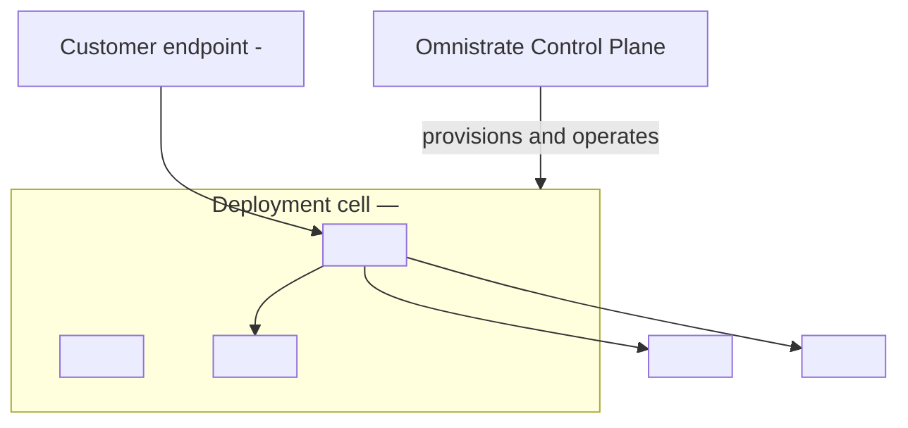
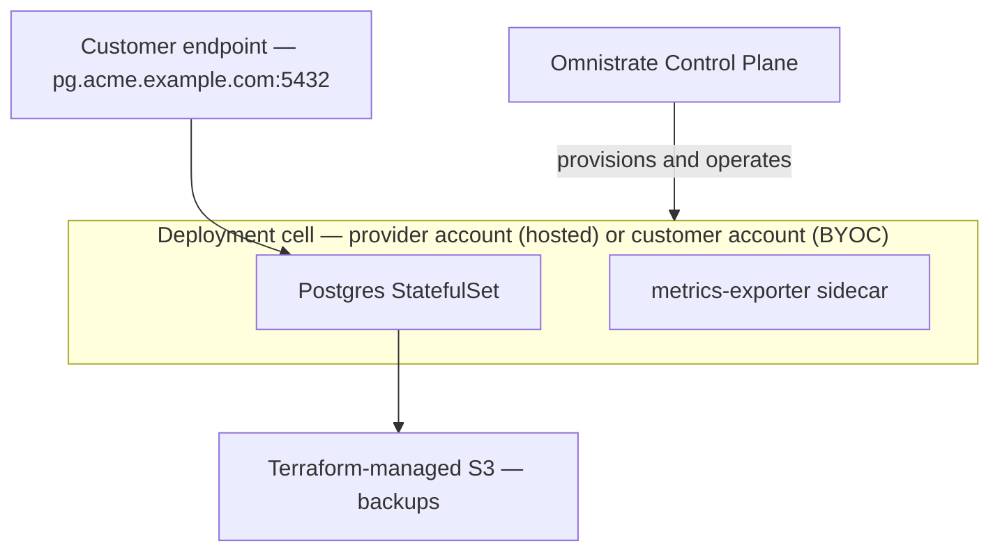

# Distribution Reference — Release, Portal, Go-Live, and the Deployment Overview Artifact

How to take a working Plan (an instance reaching RUNNING, or an installer artifact
produced) and turn it into a distributable SaaS: release the version, make it
reachable, configure the Customer Portal, optionally add billing, and generate a
`DEPLOYMENT_OVERVIEW.md` artifact for the ISV.

Verified against the Omnistrate docs under `/documentation/docs/`:
`tenant-management/customer-portal.md`, `tenant-management/subscription-management.md`,
`dev-ops-guides/environments.md`, `dev-ops-guides/upgrades.md`, `fin-ops-guides/billing.md`,
`spec-guides/plan-spec.md`, `getting-started/getting-started-with-ctl.md`. When this file
conflicts with the live docs or CLI `--help`, trust the docs/CLI.

Per-model customer experiences below reuse facts from
[DEPLOYMENT_MODELS_REFERENCE.md](DEPLOYMENT_MODELS_REFERENCE.md) (same-skill link) rather than
re-deriving them.

---

## 1. Release the plan

Every change to your SaaS is **versioned and immutable once released**. Source:
`dev-ops-guides/upgrades.md`. A version is in one of these states:

| State | Meaning |
|-------|---------|
| **Unreleased** | Omnistrate accumulates your edits here; still editable. |
| **Active** | A valid released version. Can be marked Preferred or used as an upgrade target. |
| **Preferred** | The default version used by existing and new customers for new usage. **Exactly one** Preferred version exists at a time; promoting another Active version to Preferred demotes the previous one back to Active. |
| **Deprecated** | No longer valid; by definition no customer instances may reference it. |

By default a new version is released as **Active** — you may test before promoting
it to Preferred (the default your customers get). Release with the build command
(source: `getting-started/getting-started-with-ctl.md`):

```bash
# Release as Active (available to create instances, not yet the default)
omnistrate-ctl build --file spec.yaml --product-name "MyProduct" \
  --release --release-description "Initial GA of the managed plan"

# Release AND promote to Preferred (becomes the default version for new usage)
omnistrate-ctl build --file spec.yaml --product-name "MyProduct" \
  --release-as-preferred --release-description "Add storage-size parameter"
```

- `--release` — release the version (makes the Plan available for instance creation).
- `--release-as-preferred` — release and promote to Preferred in one step (the
  default version customers get).
- `--release-description` — always include it; it makes each Plan version easier
  to audit later.

If the rendered spec is unchanged, Omnistrate may reuse the existing Plan version
instead of creating a new one. Use `--force-create-service-plan-version` only when
you explicitly need a new released version for identical inputs.

---

## 2. Make it reachable — environment visibility

Source: `dev-ops-guides/environments.md`, `tenant-management/customer-portal.md`.

- **Non-production environments are always private** — accessible only to your
  organization members. Use Dev/Staging portals to test Plans, pricing, and portal
  configuration before customers see them.
- **Production can be made PUBLIC** to allow customer self-service signup and
  subscription. Toggle it in **Dev-Ops > Environments** ("going live" makes the
  Production environment Public). Once public + portal configured, your SaaS is
  reachable on your custom domain for customers to sign up and launch instances.

> Note: if you signed up to Omnistrate via SSO, create a separate password for
> your account to sign in to the non-production Customer Portals.

---

## 3. The Customer Portal

Source: `tenant-management/customer-portal.md`.

**What it is.** A ready-to-use, no-code web UI that Omnistrate **auto-deploys per
environment** the first time you create that environment. Open it from the Build
Service tab via **"Access SaaS Product"**. It is open-source and can be forked,
white-labeled, or replaced with a custom API integration.

**What customers do there:**

- Sign up and subscribe to a Plan.
- Create/manage instances, supplying your **exported API parameters** (the Tier-1
  parameters you defined during customization discovery).
- Connect their **BYOC** cloud accounts (walked through the cloud-specific setup).
- Invite team members and manage their organization.
- View usage and billing (when billing is enabled).
- Manage the full instance lifecycle (create, start/stop, modify, delete, monitor).

**Configuration surface** (Tenant Management > Customer Portal, per environment):

| Setting | What it does |
|---------|-------------|
| **Custom domain** | Host the portal on your domain (e.g. `portal.yourcompany.com`) via **CNAME** records. Fully white-labels the URL. |
| **Sender email (SMTP)** | Send all system emails from your domain — SMTP Username, Password, Host, Port, and **From Email**. |
| **Identity providers (SSO)** | Any **OpenID Connect** provider: Google, GitHub, Okta, Auth0, Microsoft Entra, AWS Cognito, Keycloak, and others. You can disable username/password to force SSO-only. |
| **Google Analytics** | Set your Google tag ID for usage analytics. |
| **Custom portal image** | Point Omnistrate at a **publicly accessible** container image (name + tag) to host your own forked/custom portal. Requires SMTP sender email to be configured too. |

Each environment gets its own portal with its own domain, branding, email, and
IdP settings.

---

## 4. Subscriptions

Source: `tenant-management/subscription-management.md`, `tenant-management/customer-portal.md`.

A **subscription** is the agreement granting a customer access to a Plan — access
rights, resource allocation, service level, and billing terms. Approval mode is
configurable:

- **Auto-approve** — subscriptions are instantly activated (streamlined post-launch).
- **Manual review** — subscription requests are queued for your team's approval
  (tight control during beta / initial launch).

Subscription statuses:

| Status | Meaning |
|--------|---------|
| **Active** | Full access; the customer can create and manage instances. |
| **Suspended** | Intact but frozen — no new instances; existing instances and details remain (e.g. billing issue). Reactivatable. |
| **Terminated** | Ended (contract end, cancellation, policy enforcement). |

**Customer-side RBAC** (subscription/organization level): **root**, **admin**,
**member**, and **reader** roles — customers invite teammates and assign these
fine-grained roles.

---

## 5. Pricing & billing (optional)

Source: `fin-ops-guides/billing.md`, `spec-guides/plan-spec.md`.

**No billing configured = free tier.** Billing is opt-in. To enable it: enable
Tenant Billing at the account level (FinOps Center > Tenant Billing), connect a
billing provider (Stripe via Stripe Connect, or bring your own), then configure
pricing and providers on the Plan.

**Pricing** — usage-based, over pre-set dimensions. Copied from `fin-ops-guides/billing.md`
(also settable in the plan spec's `pricing` block):

```yaml
pricing:
- dimension: cpu
  unit: cores
  timeUnit: hour
  price: 0.01
- dimension: memory
  unit: GiB
  timeUnit: hour
  price: 0.05
- dimension: storage
  unit: GiB
  timeUnit: hour
  price: 0.02
- dimension: replica
  timeUnit: hour
  price: 0.10
- dimension: deploymentCell
  timeUnit: hour
  price: 0.10
```

**Billing providers** — copied from `fin-ops-guides/billing.md`:

```yaml
billingProviders:
- name: stripe
  externalProductID: "prod_123"
  enablePaywall: false
  isDefault: true
- name: BYO Billing Provider   # the name you set at account level
  isDefault: false
```

- `name` — `stripe` (case-insensitive) or your BYO provider's name; all providers
  must be enabled for tenant billing at the account level.
- `isDefault` — exactly one provider is the default for new subscribers.
- `externalProductID` — (Stripe only) product ID used to track the Plan in Stripe.
- `enablePaywall` — (Stripe only) `true` requires a valid payment method before a
  customer can create instances; `false` (default) does not.

**Quota** — cap instances per subscription (copied from `fin-ops-guides/billing.md`):

```yaml
maxNumberOfInstancesAllowed: 5
```

> Plan-level pricing/billing/quota changes do **not** retroactively apply to
> existing subscriptions — manage those under FinOps Center > Tenant Pricing.

---

## 6. Go-live checklist (ordered)

1. **Release Preferred** — `omnistrate-ctl build ... --release-as-preferred --release-description "..."`.
2. **Make the prod environment Public** — Dev-Ops > Environments.
3. **Configure the portal** — custom domain (CNAME), SMTP sender email, SSO IdP(s).
4. **(Optional) Billing** — enable tenant billing, connect provider, set `pricing` +
   `billingProviders` + `maxNumberOfInstancesAllowed`.
5. **Set subscription approval mode** — auto-approve or manual review.
6. **Distribute the portal URL** to customers.
7. **Monitor subscriptions** — review requests, statuses, and instances.

---

## 7. Per-model customer experience

One paragraph per deployment model. Facts reused from
[DEPLOYMENT_MODELS_REFERENCE.md](DEPLOYMENT_MODELS_REFERENCE.md) — see it for the
`deployment:` blocks and account-onboarding flows.

- **Hosted** — the customer signs up in your portal, subscribes, and creates
  instances directly. Everything runs in *your* provider cloud account; the
  customer never touches cloud credentials. See
  [DEPLOYMENT_MODELS_REFERENCE.md § Hosted](DEPLOYMENT_MODELS_REFERENCE.md#hosted).

- **BYOC (customer cloud account)** — the customer **connects their own cloud
  account** from the portal, which walks them through the cloud-specific setup
  (CloudFormation for AWS; Cloud Shell / Terraform for GCP/Azure) and tracks
  account status. Their first instance in an account+region bootstraps the
  deployment cell; instances run in *their* account. See
  [DEPLOYMENT_MODELS_REFERENCE.md § BYOC](DEPLOYMENT_MODELS_REFERENCE.md#byoc-customer-cloud-account).

- **BYOC-K8s (customer-managed Kubernetes)** — the customer runs the **install
  kit** to connect their existing cluster (the cluster opens an outbound mTLS/gRPC
  channel to your control plane); Omnistrate provisions no infra and deploys
  workloads only. See
  [DEPLOYMENT_MODELS_REFERENCE.md § BYOC-K8s](DEPLOYMENT_MODELS_REFERENCE.md#byoc-k8s-customer-managed-kubernetes).

- **Air-gapped** — the customer receives a self-contained **installer artifact**
  and runs it against their cluster with **no live control-plane connection**; the
  customer owns connectivity, updates, and support. Here the deliverable is the
  installer, not a portal instance. See
  [DEPLOYMENT_MODELS_REFERENCE.md § Air-gapped](DEPLOYMENT_MODELS_REFERENCE.md#air-gapped--on-prem-installer).

---

## Deployment overview artifact

**Onboarding is not complete until this artifact exists.** At the very end of an
onboarding, generate a `DEPLOYMENT_OVERVIEW.md` written **next to the ISV's spec
files** (e.g. alongside `spec.yaml` or the compose file). It summarizes, for the
ISV, what was built: the architecture, the responsibility split, and how their
customers reach the product.

Fill in the template below. Keep the diagrams generic where the ISV hasn't decided
specifics, and replace every `<...>` placeholder. The Mermaid blocks must render:
**no parentheses inside `[ ]` node labels**, and quote any label containing special
characters.

### Template

````markdown
# Deployment Overview — <Product Name>

_Generated at the end of Omnistrate onboarding. Deployment model(s): <hosted / BYOC / BYOC-K8s / air-gapped>._

## 1. Architecture



_Delete the terraform-managed nodes/arrows if the chart keeps its dependencies in-cluster._

## 2. Responsibility split

| Customer controls | ISV controls | Platform manages |
|-------------------|--------------|------------------|
| <Tier-1 param 1> = <default> | Hardcoded chart/compose values | Placement / node scheduling |
| <Tier-1 param 2> = <default> | Product versions (chart/image) | Networking, DNS, TLS |
| <Tier-1 param 3> = <default> | Upgrade cadence | Storage provisioning |
| Cloud account (BYOC only) | Tier-2 defaults | Backups (if configured) |
|  |  | Licensing (BYOC / air-gapped) |

## 3. Distribution summary

- **Portal URL:** <https://portal.yourcompany.com — placeholder>
- **Subscription mode:** <auto-approve / manual review>
- **Steps your customers follow:**
  - Hosted: sign up in the portal, subscribe, create an instance with the parameters above.
  - BYOC: sign up, connect their cloud account (portal walkthrough), then create an instance in their account.
  - BYOC-K8s: sign up, run the install kit against their cluster, then create an instance.
  - Air-gapped: receive the installer artifact and run it against their cluster (no live link).
````

### Small filled example — "Acme Postgres"

````markdown
# Deployment Overview — Acme Postgres

_Generated at the end of Omnistrate onboarding. Deployment model(s): Hosted (starter/pro) + BYOC (enterprise)._

## 1. Architecture



## 2. Responsibility split

| Customer controls | ISV controls | Platform manages |
|-------------------|--------------|------------------|
| instanceType = db.t3.medium | Postgres chart version 15.x | Placement / node scheduling |
| storageSizeGi = 100 | Exporter config, tuning knobs | Networking, DNS, TLS |
| dbPassword (Password) | Upgrade cadence | Storage provisioning + S3 backups |
| Cloud account (BYOC tier) | Tier-2 defaults | Licensing (BYOC tier) |

## 3. Distribution summary

- **Portal URL:** https://db.acme.example.com
- **Subscription mode:** auto-approve (starter/pro); manual review (enterprise)
- **Steps your customers follow:**
  - Hosted: sign up, subscribe, create an instance choosing instance type, storage size, and password.
  - BYOC (enterprise): sign up, connect their AWS account via the portal, then create the instance in their account.
````
